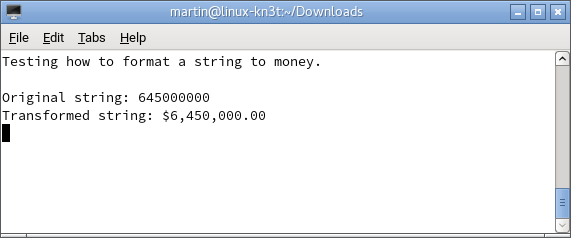

# How to format a string as currency
        

            You can use the <i>String.Format()</i> method to localize the format of data such as dates,times, numbers, and currencies, according to the
            culture in the currently executing thread.
            The following example shows how to display a currency according to the current culture. 
        

        
<b>Fig 1. Displays a localized currency value.</b>
 
        

 
